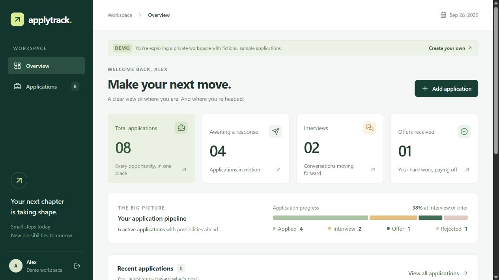
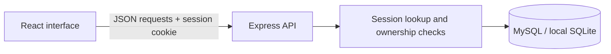

# ApplyTrack

A full-stack job application tracker with a React interface, a Node.js/Express API, and a MySQL database adapter. A built-in SQLite option makes the project easy to try without installing a database server.

Track the journey from **Applied → Interview → Offer**, keep rejection records, and save the details of every opportunity.



## Features

- Registration and login with salted scrypt password hashes.
- HTTP-only cookie sessions stored as hashes in the database.
- Separate application records for each user.
- Add, edit and delete applications, including company, role, location, date, status, job link and notes.
- Dashboard totals and a status pipeline calculated from saved records.
- Search by company, role or location; filter by status; sort by date or company.
- A private demo workspace with eight clearly fictional sample applications.
- Responsive layout, keyboard-accessible forms and confirmation dialogs.
- API integration tests and a GitHub Actions workflow.

## Stack

| Layer | Technology |
| --- | --- |
| Interface | React 19, CSS, Lucide icons |
| Build tool | Vite 7 |
| API | Node.js, Express 5 |
| Database | MySQL 8.4 through mysql2; SQLite for local demos |
| Authentication | Node crypto scrypt, random opaque sessions, HTTP-only cookies |
| Tests | Node's built-in test runner and real HTTP requests |

Use **Node.js 24 LTS** and **pnpm 11.19.0**. The repository includes the dependency lockfile.

## Run the local demo

Clone the project, then open its folder:

```sh
git clone https://github.com/sudharsan24-dev/applytrack.git
cd applytrack
```

From this project folder:

```sh
pnpm install --frozen-lockfile
pnpm dev
```

Open **http://localhost:5173**. Click **Explore the demo**, or create an account for an empty personal workspace. Local data survives restarts in `data/applytrack.sqlite`.

If pnpm is missing, install it with `npm install -g pnpm@11.19.0` after installing Node.js.

The development interface runs on port 5173, and its `/api` requests are forwarded to the backend on port 3001. Use `localhost` for the browser address; the development origin check expects `http://localhost:5173`.

## Use MySQL

1. Copy `.env.example` to `.env` (`Copy-Item .env.example .env` in PowerShell).
2. Set `DB_DRIVER=mysql`. Set your host, port, database name, username and password.
3. Create the `applytrack` database and a dedicated database user. The server creates the tables automatically. `database/schema.sql` documents the schema.
4. Run `pnpm dev`.

Example configuration (replace the password):

```dotenv
DB_DRIVER=mysql
MYSQL_HOST=127.0.0.1
MYSQL_PORT=3306
MYSQL_DATABASE=applytrack
MYSQL_USER=applytrack
MYSQL_PASSWORD=your-local-password
APP_ORIGIN=http://localhost:5173
```

If Docker is installed, the included `compose.yaml` can start MySQL instead of installing it directly. Add a separate `MYSQL_ROOT_PASSWORD` to `.env`, then run:

```sh
docker compose up -d --wait
pnpm dev
```

The database volume persists after the container stops. Do not commit `.env` or database files. SQLite data is separate from MySQL data; switching drivers does not migrate existing records.

## Tests and build

```sh
pnpm test
pnpm build
```

The integration suite uses a fresh in-memory SQLite database. It checks registration, login, session expiry, logout, application CRUD, validation, SQL-looking input, cross-origin writes, user isolation and demo isolation. It does **not** establish that the MySQL connection works on your machine.

To serve the built interface and API together, set `APP_ORIGIN=http://localhost:3001` in `.env`, then run `pnpm start` and open http://localhost:3001.

On Windows, `Start-ApplyTrack.cmd` starts a local SQLite demo after dependencies have been installed. It also recognizes the bundled Codex Node runtime on this computer.

## Architecture



```text
src/                 React interface and responsive styles
server/app.js        Auth, validation and application endpoints
server/database.js   MySQL / SQLite database adapters and table setup
server/index.js      Server startup and shutdown
database/schema.sql  Reference schema
test/api.test.js     HTTP integration tests
docs/                Walkthrough and handoff notes
.github/workflows/   Automated tests and production build
```

Three tables are used: `users`, `sessions` and `applications`. Every application query includes the authenticated user's ID. Parameterized SQL prevents input from being treated as query syntax.

## API

| Method | Endpoint | Purpose |
| --- | --- | --- |
| POST | `/api/auth/register` | Create an account |
| POST | `/api/auth/login` | Sign in |
| POST | `/api/auth/logout` | Invalidate the current session |
| GET | `/api/auth/me` | Read the signed-in user |
| POST | `/api/auth/demo` | Create an isolated sample workspace |
| GET | `/api/applications` | List the user's applications |
| POST | `/api/applications` | Add an application |
| PUT | `/api/applications/:id` | Replace editable application fields |
| DELETE | `/api/applications/:id` | Delete an owned application |
| GET | `/api/health` | Read the API process health |

Writes use `Content-Type: application/json`. Browser writes must come from `APP_ORIGIN`. Sessions expire after seven days. Old demo workspaces are removed when a new demo is created after their seven-day retention period; demo access should not be used for long-term personal records.

## Repository

Source: [sudharsan24-dev/applytrack](https://github.com/sudharsan24-dev/applytrack).

Read `docs/PROJECT-WALKTHROUGH.md` for the architecture and interview explanation. The `.gitignore` excludes secrets, dependencies, local data and generated builds.

## Scope and limitations

This is an educational portfolio project. It has no password reset, email verification, OAuth, email delivery, reminders or resume uploads. Search and sorting happen in the browser and are intended for a personal-sized application list. Concurrent edits use the most recently saved version.

For an internet deployment, use HTTPS, `NODE_ENV=production`, the correct `APP_ORIGIN`, a private managed database and appropriate backups. Production mode makes cookies secure. The included rate limiter is in memory; a multi-instance deployment needs shared rate-limit storage and deliberate proxy configuration. The local startup script is not a cloud deployment.

Do not describe MySQL as verified until you have run this project against a MySQL server. See `docs/VERIFICATION.md` for what was actually tested during creation.
